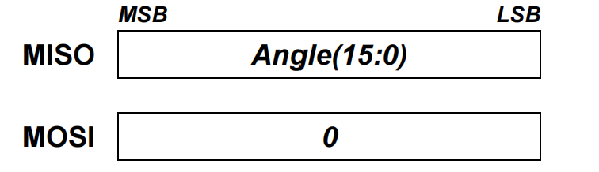

# 如何合理的配置SPI

- [如何合理的配置SPI](#如何合理的配置spi)
  - [1. SPI 配置](#1-spi-配置)
  - [2. DMA configuration](#2-dma-configuration)
  - [reference](#reference)

## 1. SPI 配置

一般来讲，SPI有如下需要配置的参数：

1. Data Size: 显而易见，即一个数据帧的数据长度，需要根据设备手册来配置
2. First Bit：MSB or LSB 这两个数据都可以在芯片的手册上找到。例如：
3. Clock polarity(COPL): CLock 的极性，
   1. High：总线空闲时 CLock 是 High，第一个电平是下降沿
   2. LOW：总线空闲时，CLock 是 LOW，第一个电平是上升降沿
4. CLock Phase(CPHS)：对 MISO, MOSI 的采样时机
   1. 1 edge：即在 CLK 的第一个上升沿/下降沿进行采样
   2. 2 edge：即在 CLK 的第二个上升沿/下降沿进行采样

## 2. DMA configuration

DMA is a system peripheral, the full name is Direct Memory Accrss controller.

## reference

[The SPI Bus](https://www.realdigital.org/doc/6c55fef7bba4a22ff35dce46a3c359af)
