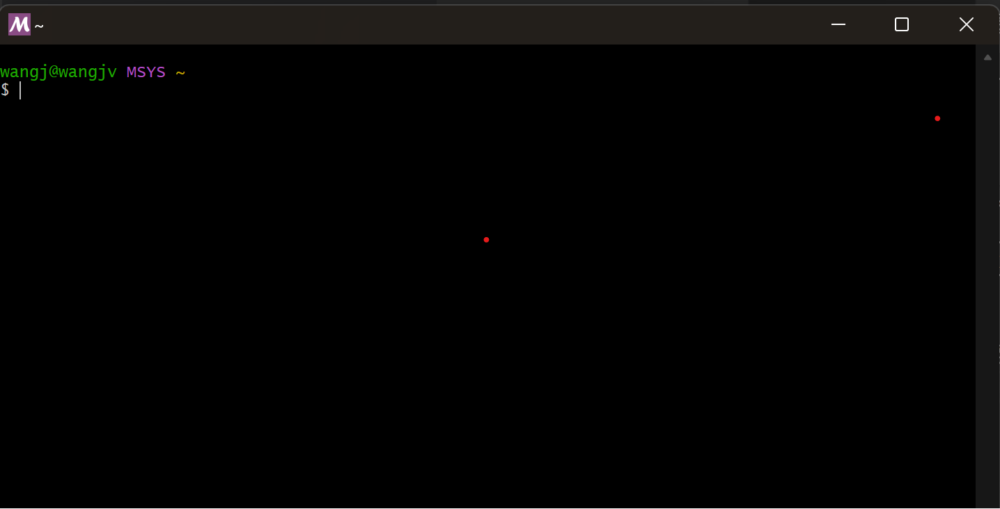
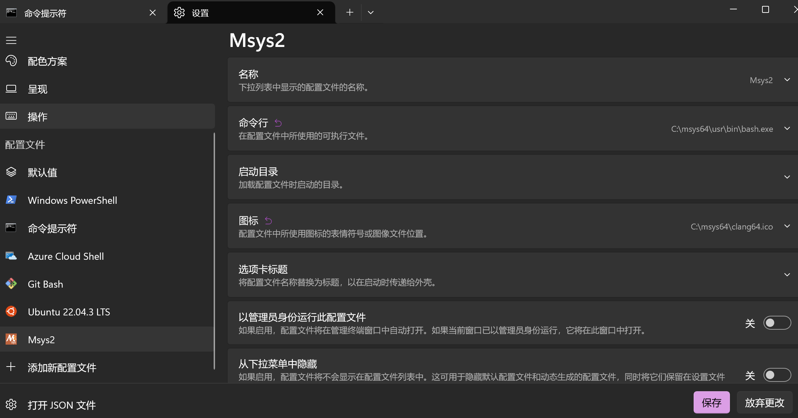

# 开发环境搭建

- [开发环境搭建](#开发环境搭建)
  - [1. 开发工具](#1-开发工具)
    - [1.1. 需要安装的工具](#11-需要安装的工具)
    - [1.2. vscode 插件](#12-vscode-插件)
  - [2. 开发环境搭建](#2-开发环境搭建)
    - [2.1. 安装编辑器](#21-安装编辑器)
    - [2.2 安装 Msys2](#22-安装-msys2)
      - [2.2.1 将 Msys2 添加到 Terminal 下](#221-将-msys2-添加到-terminal-下)
      - [2.2.2 Msys2 配置](#222-msys2-配置)
      - [2.2.3 安装工具](#223-安装工具)
      - [2.2.4 配置 Msys2 为 vscode 的默认shell](#224-配置-msys2-为-vscode-的默认shell)
  - [参考](#参考)

## 1. 开发工具

### 1.1. 需要安装的工具

在开发中，我们需要安装如下工具。其中一些时 win 下需要的。

1. `MinGW-64`: win下的c/c++编译器。它实质上是将在 unix 上的著名编译器 GCC 移植到了 win 上。此外还包含一些 win 所特有的特性。可以理解为 MinGW 是对 Win 特化的 GCC。而 MinGW-64 就是64位系统的 WinGW。

2. `Cmake`: Cmake 是一个全平台的编译工具，当我们的代码十分复杂，有多个文件时，一个一个编译和链接就不太现实了，Cmake 就是一个帮我们生成自动化编译链接脚本 `makefile` 的工具。

3. `gcc-arm-none-xxxx`: 由 ARM 维护的嵌入式交叉编译工具集，让我们可以在 pc 上生成嵌入式芯片上执行的代码。

4. `Msys2`: 在 linux 上进行过开发的朋友一定会对 apt 这样的包管理印象深刻。但是 win 并不是原生的有这个工具。`Msys2`就起到了这个作用，它提供了编译好的一系列开发工具，还提供了一个 shell like 的命令行工具。

5. `vscode`: 没什么可说的，可能是最好的文本编辑器

6. `ozone`: Segger 开发的调试软件，功能强大。

7. `openOCD`: 多平台且开源的调试框架。

### 1.2. vscode 插件

1. `clangd`: 为什么要使用clangd，可以参考这篇blog：[VSCode-使用Clangd搭建C++开发环境](https://zhuanlan.zhihu.com/p/583201222)。总的来说，clangd提供了比经典的 microsoft c/c++ 更好的代码补全，提示和跳转。

2. `Corten-Debug`: 提供了嵌入式的调试功能，可以查看寄存器、内存、断点调试、实时内存查看、scope等功能。

3. `Embedded Tools`: Microsoft 开发的嵌入式调试工具，和 `cortex-Debug`是一个道理，但是似乎没有前者强大（没有scope功能）。

4. `cmake`, `cmake-tool`: 提供了一键的编译、运行、调试工具。一键生成 makefile 并直接运行（可以通过 launch 的方式连接到嵌入式上）。

5. `c/c++`: 和 `clangd` 一个道理，很多人都在用它。

6. `Makefile Tools`: 提供 makefile 的高亮。虽然我们基本不需要直接操作 makefile 。

7. `Git Graph`, `GitLens`: git 插件，方便我们进行 git 管理，可视化的进行版本对比，add 和 commit 。

## 2. 开发环境搭建

在 linux 下开发环境搭建比较简单，我们不做太多介绍。主要讲讲怎么在win下搭建开发环境。

### 2.1. 安装编辑器

`vscode`怎么安装应该不需要介绍吧(应该吧)。可以直接在 [Visual Studio Code installer](https://code.visualstudio.com/Download) 下载并安装。安装好 vscode 后，建议安装上面说的那些插件。在这里我再列一下，可以安装一个打一个勾 ;) 。

- `clangd`
- `Embedded Tools`
- `cmake`
- `cmake-tool`
- `c/c++`
- `Makefile Tools`
- `Git Graph`
- `GitLens`

### 2.2 安装 Msys2

Msys2 是一个轻量化的 Win 端包管理工具。它不 vcpkg 一样强大但是同样臃肿，Msys2 十分轻量化。可以在[msys2-x86_64-20240113.exe](https://github.com/msys2/msys2-installer/releases/download/2024-01-13/msys2-x86_64-20240113.exe) 下载 Msys2。安装过程可以参考[Msys getting started](https://www.msys2.org/)。Msys2 的安装位置基本不会影响它的使用，但是你一定要搞清楚具体安装在哪了，这对后面的操作很重要。

安装完成后，在 WIN 开始界面下应该能找到 MSYS2 Terminal。



但是此时的 Terminal 界面十分简陋，这并不能让我们满意。我们可以把 Msys 加到 Win 的 Terminal 下。

#### 2.2.1 将 Msys2 添加到 Terminal 下

在开始界面搜索 `Terminal` 或者`终端`，可以找到就可以找到：


打开 `terminal` 后，直接按下 `ctrl+,` 键，即可打开 terminal 的设置界面。打开后可以在右侧的选项卡中找到 `+ 添加配置文件` 按钮。后点击 `+ 新建空的配置文件`，并做如下配置：



需要注意的是，一定要将目录改成你的 `Msys2` 的具体位置。如果你希望，可以在 `启动` 选项卡中将 `Msys2` 作为默认配置文件，这样直接右键就可以打开 Msys2 了。

#### 2.2.2 Msys2 配置

首先，我们要给 `Msys2` 换源。一般换源的时候不要随便搜一个博客就把链接复制进去，因为你不知道你看的博客里的链接是什么年代的源了。我们可以直接去清华源头的网站找到能用的软件源：[TUNA MSYS2软件仓库](https://mirrors.tuna.tsinghua.edu.cn/help/msys2/)。

```shell
sed -i "s#https\?://mirror.msys2.org/#https://mirrors.tuna.tsinghua.edu.cn/msys2/#g" /etc/pacman.d/mirrorlist*
```

直接复制运行即可。之后重新启动 `Msys2` 并更行软件包数据:

```shell
pacman -Sy
```

之后我们需要配置 `Msys2` 的代理。打开 `~/.bashrc`，并添加：

```shell
export http_proxy="127.0.0.1:port"
export https_proxy="127.0.0.1:port"
export all_proxy="127.0.0.1:port"
```

并重新启动终端即可。

下一步我们需要将 Msys2 的软件包配置到环境变量中。我们需要在`系统环境-Path`中添加:

```shell
YourPath\msys64\mingw64\bin
YourPath\msys64\usr\bin
```

并创建一个新的，名为 `HOME` 的环境变量，配置为：

```shell
YourPath\msys64\home\YourName
```

注意将 `YourPath` 和 `YourName` 安装你的实际情况更改。

#### 2.2.3 安装工具

首先，我们安装一些很有用的工具：

```shell
pacman -S vim git
```

之后安装需要的编译工具：

```shell
pacman -S mingw-w64-x86_64-toolchain mingw-w64-x86_64-arm-none-eabi-toolchain mingw-w64-x86_64-ccache  mingw-w64-x86_64-openocd
```

需要注意一下，`OpenOCD`也在这个目录下 `YourPath\Msys2\mingw64\share\openocd`，配置 vscode 的 `launch.json`  文件时会用到。

#### 2.2.4 配置 Msys2 为 vscode 的默认shell

在 vscode 中按下 `ctrl+,`，向 `settings.json` 中添加：

```json
  "terminal.integrated.defaultProfile.windows": "mysys2-mingw64", // 若希望为默认终端可以加入这一句
  "terminal.integrated.profiles.windows": {
    "mysys2-mingw64": {
      "path": "cmd.exe", // 意思是使用cmd作为父进程启动终端
      "args": ["/c","C:\\msys64\\msys2_shell.cmd -defterm -mingw64 -no-start -here"]
        // msys2_shell.cmd在msys的安装目录下，这里要改为你自己的目录
    }
  }
```

当然在你的工程的 `.vscode/settings.json` 中添加也可以。此时 `vscode` 的默认 `shell` 就被替换成了 `Msys2`。

## 参考

[gcc for arm 工具链使用](https://blog.csdn.net/fdcp123/article/details/114537469)
